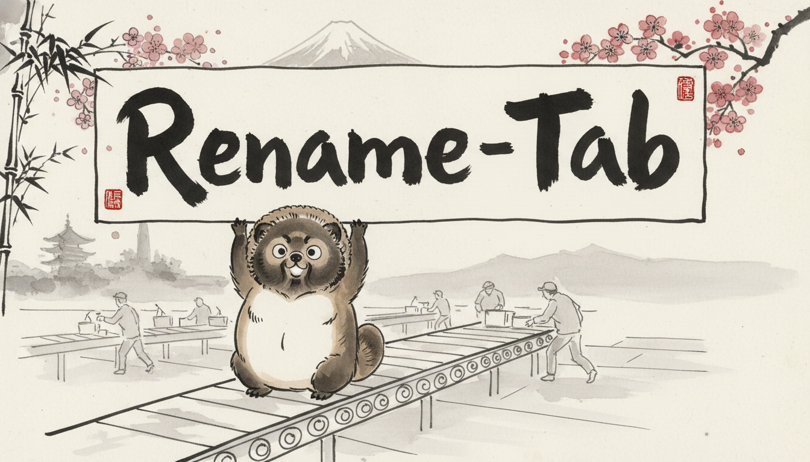
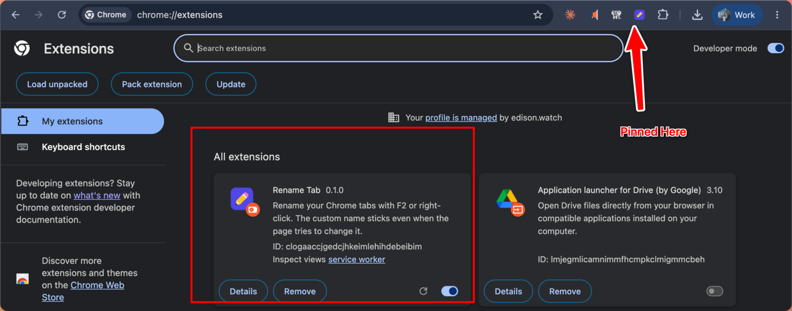

# Rename Tab

<p align="center">
  
</p>

<p align="center">
<b>Give any Chrome tab a name of your own, and make it stick, even when the page fights back.</b>
</p>

Rename Tab is a tiny **Manifest V3** Chrome extension. You rename the tab you're on,
and the new name shows up wherever Chrome draws your tabs, **including a vertical tab
strip**, and survives the SPAs (Gmail, YouTube, Notion…) that constantly rewrite their
own title.

## Quick start

```bash
make setup     # cd extension && bun install
make build     # production build -> extension/dist
```

Then load it: open `chrome://extensions` → enable **Developer mode** →
**Load unpacked** → select **`extension/dist`**.

**Pin the toolbar icon now** is the main way you'll trigger a rename. Click the
puzzle-piece 🧩 in Chrome's toolbar and pin **Rename Tab**. The pencil icon that
appears is your rename button.

<p align="center">
  
  <br>
  <em>Loaded via “Load unpacked,” then pinned to the toolbar. That pencil is your rename button.</em>
</p>

> For live development with hot-reload, run `make dev` instead of `make build`, load
> `extension/dist` once, and CRXJS reloads on every save.

## How to rename a tab

| Trigger | Notes |
| --- | --- |
| **Click the pencil toolbar icon** | The reliable one; works from anywhere, even while you're in the tab strip. |
| **F2** | Works on any normal page, **but only when the page has keyboard focus** (click into the page first). |
| **Right-click the _page_ → Rename tab** | The context-menu route. Right-click the website body, not the tab. |
| **A global shortcut** *(optional)* | Assign one at `chrome://extensions/shortcuts` (e.g. `Alt+R`), and fires even from the tab strip. |

A small editor pops up in the page. Type the new name, then:

- **Enter** saves · **Esc** cancels · **empty + Enter** clears the rename.
- Tick **Remember for this URL** to make it permanent (see below).

By default a rename follows the **tab** until you close it. "Remember for this URL"
ties it to the **URL** instead, so it survives restarts and comes back on every visit.

It can't rename privileged pages (`chrome://*`, the Chrome Web Store, the New Tab Page,
PDFs). Chrome blocks extensions there, so the trigger simply no-ops.

## You can't right-click the tab itself: here's why

The obvious move is to right-click the tab and look for "Rename." **That menu is
Chrome's own, and no extension can add to it.** Chrome exposes *no* API for the native
tab strip. You can't add to a tab's right-click menu, and you can't double-click a tab
to edit it (that's [Arc](https://arc.net), which is its own browser, not an extension).

The only lever Chrome gives an extension is the page's `document.title`. So Rename Tab
overrides that from a content script and keeps it pinned with a `MutationObserver`; the
name you typed then appears on the native tab as a side effect. That's the whole trick,
and it's why renaming is triggered from the page / toolbar rather than the tab.

See [`extension/README.md`](extension/README.md) for the architecture and dev details.

## Project layout

```
extension/          # the extension (TypeScript + Vite + CRXJS)
  src/              # background.ts, content.ts, messages.ts
  public/icons/     # pencil app icons (icon.svg is the source)
  manifest.config.ts
media/banner.png    # the raccoon mascot
Makefile            # setup / dev / build / zip / lint / typecheck
```

## Tech

Bun · TypeScript · Vite · [CRXJS](https://crxjs.dev) · Biome, on Chrome's Manifest V3.
